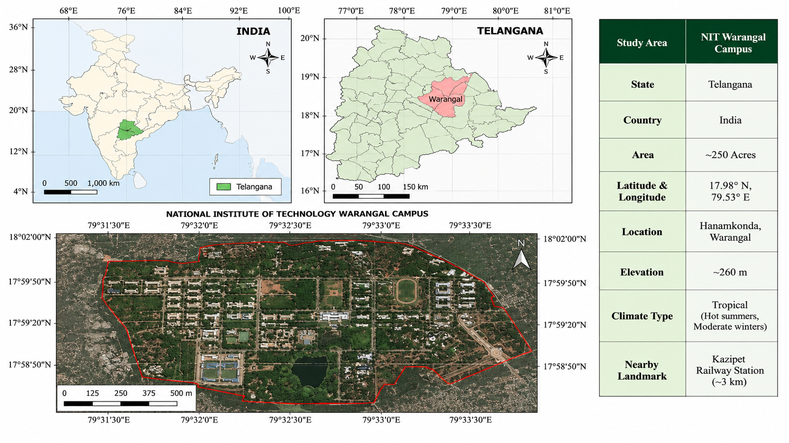
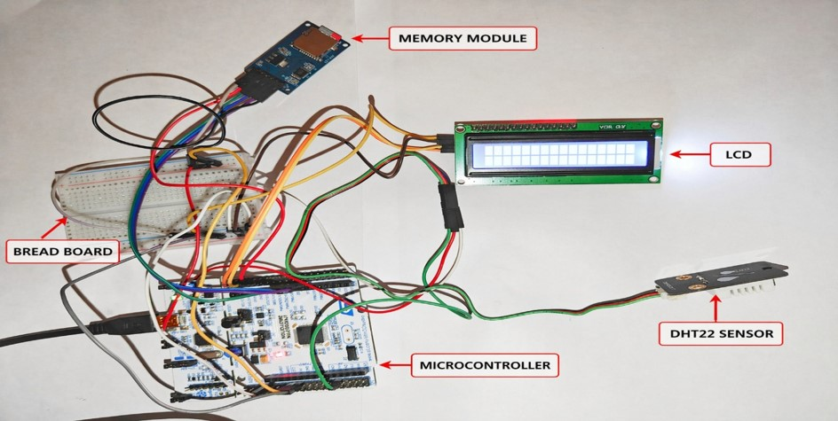
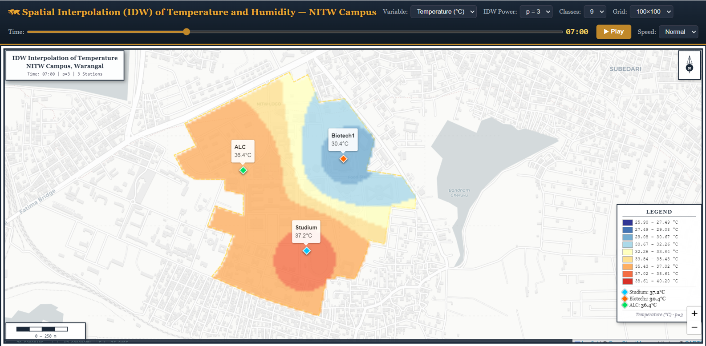

# spatial-interpolation-dht22-webgis

## Overview
This project integrates IoT, GIS, Spatial Interpolation, and WebGIS to monitor and visualize temperature and humidity variations across the NIT Warangal campus.

A network of DHT22 sensors connected to STM32 Nucleo-L476RG microcontrollers was deployed at multiple locations to collect geo-referenced environmental data. The observations were processed and interpolated using Inverse Distance Weighting (IDW) to generate continuous temperature and humidity surface maps, which were published through an interactive WebGIS platform.

## Objectives

-To collect temperature and humidity data from DHT22 sensors deployed at multiple spatial locations, preprocess the readings, and apply IDW spatial interpolation to generate continuous environmental surface maps.

-To develop a WebGIS platform that displays the interpolated maps interactively, supports time-based variation visualization at defined intervals, and makes the data publicly accessible without requiring specialized GIS software.

## Workflow

DHT22 Sensors
      ↓
STM32 Microcontroller
      ↓
CSV Data Collection
      ↓
Data Processing
      ↓
IDW Spatial Interpolation
      ↓
Temperature & Humidity Maps
      ↓
   WebGIS

## Technologies Used

- DHT22 Sensor
- STM32 Nucleo-L476RG
- Python
- Leaflet.js
- GIS & WebGIS
- IDW Interpolation

## Key Results

- Temperature ranged from 24°C to 33°C
- Humidity ranged from 45% to 75%
- Significant microclimatic variation observed within 500–800 m
- Built-up areas showed higher temperatures and lower humidity
- Vegetated areas showed lower temperatures and higher humidity

## 🖼 Project Outputs

### Study Area

### Sensor Setup

### WebGIS Dashboard

